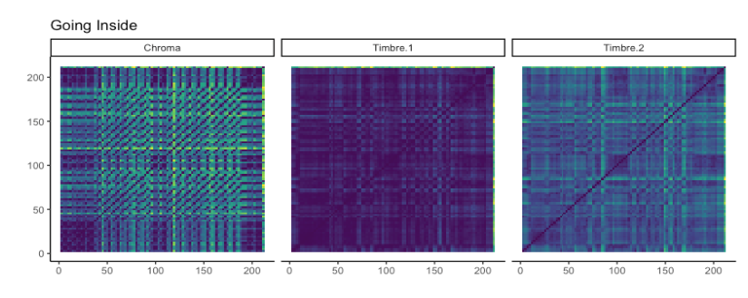

```{r setup}
library(tidyverse)
library(plotly) # N.B. Requires the Cairo package
library(spotifyr)
library(compmus)
library(dplyr)
library(gridExtra)
library(ggplot2)
library(tidymodels)
library(ggdendro)
library(heatmaply)
library(flexdashboard)
library(png)
library(knitr)
library(cowplot)
library(magick)
library(gridGraphics)
```

```{r songs}
Niandra_and_TShirt <- get_playlist_audio_features(".", "0sCFlO6qvFmlLOrg1HcsfS")
To_Record_Water <- get_playlist_audio_features(".", "7pWg3SxXi9rCIIzcj9wS5U")
Both_Albums <-
  Niandra_and_TShirt %>%
  mutate(playlist = "NLDAUJATS") %>%
  bind_rows(To_Record_Water %>%  mutate(playlist = "TROWFTD")) %>%
  mutate(
    playlist = fct_relevel(playlist, "NLDAUJATS", "TROWFTD")
  )
```


Introduction {.storyboard}
=========================================

### How About Some Revalidation Spotify? Comparing the **decent** and **recovery** of John Frusciante through music.

John Frusciante is American musician best known as the guitarist of The Red Hot Chili Peppers (RHCP). Besides his work for the RHCP, he has had an accomplished and diverse solo career. In 1992 he left RHCP for the first time and released his debut solo album two years later, in November 1994. The album consists of two parts: *Niandra LaDes* and *Usually Just A T-Shirt*. *Niandra LaDes* was mostly recorded during the writing and recorded of RHCP album *Blood Surgar Sex Magic*, only "Running Away With You" was recorded after quitting the band. *Usually Just A T-Shirt* was recorded while the band was on tour in the months leading up to Frusciante's departure and it appears in the order it was recorded. It was during these months that his use of cocaine and heroin became more extreme. Frusciante said himself in an interview that he can hear his decline into hard drugs in the songs: "It's very sad because I hear, when I listen to it [the last two songs on the record], that it sounds like a person falling apart or it sounds like somebody about to kill themselves". It wasn't until January 1998 that Frusciante was admitted to rehab. He checked out and re-entered society about a month later. The same year Frusciante rejoined RHCP, released a new album with them and went on tour. During the tour he composed new material for his first solo record after rehabilitation, *To Record Only Water For Ten Days* (2001). What I would like to research in this corpus, is what Spotify's API can tell us about the differences in his album before rehabilitation, *Niandra Lades and Usually Just A T-Shirt* (NLDAUJATS), and after rehabilitation, *To Record Only Water For Ten Days* (TROWFTD). I will compare the two albums mostly by comparing the Spotify API on: **valence** (musical positiveness), **energy** (a perceptual measure of intensity and activity), **tempo**, **key**, **pitch** and **timbre**. 

**speechiness** (spoken word detection), **loudness** (the overall loudness of a track in decibels) and **danceability** (danceability describes how suitable a track is for dancing based on a combination of musical elements including tempo, rhythm stability, beat strength, and overall regularity) will also make an appearance in the following scatterplot

#### The Album Covers

```{r albumcovers}


```

#### Album clips

<iframe src="https://open.spotify.com/embed/album/4wTLTb4VpQtTxmeyyFOFVj?si=8ojmkQguQdeaEsZm3fNRBw" width="582" height="300" frameborder="0" allowtransparency="true" allow="encrypted-media"></iframe>
<iframe src="https://open.spotify.com/embed/album/3a9g6ueh2eVIYGTfmSoKkb?si=wttcdyxJS_CS1IxLVkPyYg" width="582" height="300" frameborder="0" allowtransparency="true" allow="encrypted-media"></iframe>

Comparing both albums {.storyboard}
=========================================

### The Two Albums In A **Scatterplot**: where do we point to next

```{r scatter}
  
  Niandra_Water <-
  Both_Albums %>%  
  ggplot(                          # Set up the plot.
    aes(
      x = valence,
      y = energy,
      colour = loudness,
      size = speechiness,
      label = track.name          # Labels will be interactively visible.
    )
  ) +
  geom_point(shape = ".") +                   # Scatter plot.
      geom_smooth(se=F) +
  geom_rug(size = 0.1) + facet_wrap(~playlist) +            
  scale_x_continuous(              # Fine-tune the x axis.
    limits = c(0, 0.76),
    breaks = c(0, 0.50, 1),        # Use grid-lines for quadrants only.
    minor_breaks = NULL            # Remove 'minor' grid-lines.
  ) +
  scale_y_continuous(              # Fine-tune the y axis in the same way.
    limits = c(0, 1),
    breaks = c(0, 0.50, 1),
    minor_breaks = NULL
  ) +
  scale_colour_viridis_c(          # Use the cividis palette
    option = "E",                  # Qualitative set.
    alpha = 0.8,                   # Include some transparency
    guide = "none"
  ) +
  scale_size_continuous(           # Fine-tune the sizes of each point.
    guide = "none"                # Remove the legend for size.
  ) +
  theme_classic() +                  # Use a simpler theme.
  labs(                            # Make the titles nice.
  )
ggplotly(Niandra_Water)
```     

***

This scatter plot shows the energy vs valence of all songs from both albums. The size represents the speechiness (the detection of spoken words in a track) and the colour represents the loudness (overall loudness of a track in dB). 

I think this graph does a great job of showing the overall difference between the two albums. For example, the smooth line shows that the lowest energy level of *TROWFTD* seamlessly picks up from where *NLDAUJATS* left it and continues to raise the bar. 

Most of the songs on *NLDAUJATS* are also generally more clustered around the bottom left corner, meaning they are low on energy and valence, while most of the songs on *TROWFTD* are clustered around the top in the middle and on the right, showing that are way higher in energy levels and 'positivity'. 

Both the speech and loudness levels are also clearly higher on *TROWFTD*. The loudest song on *NLDAUJATS* ('Big Takeover') for example, is nearly four times quieter than the loudest song on *TROWFTD* ('Fallout'). 

Something I don't understand however, is that the song 'Skin Blues' has the highest speech levels on *NLDAUJATS*. 'Skin Blues' has no vocals on it or any speech as far as I can hear, so what does Spotify analyze that sounds to it like spoken words?


### Bar Chart of **Vitality**: can comparing valence and energy levels reveal some insights?


```{r vitalitybars, fig.width=8, fig.height=5}
Valencebar <-
ggplot(Both_Albums, aes(x=playlist_name, y=valence, fill=playlist_name, label=track.name)) + 
  geom_bar(stat="identity", width=.5) + 
 labs( 
       x=NULL,
       y="Valence",
      fill=NULL) + 
  theme(axis.text.x = element_text(angle=0, vjust=0.5)) +
  scale_fill_manual(values=c("#B59377", "#3076D6"))

Energybar <-
ggplot(Both_Albums, aes(x=playlist_name, y=energy, fill=playlist_name, label=track.name)) + 
  geom_bar(stat="identity", width=.5) + 
  labs(title="Valence/Energy Vs Album", 
       x=NULL,
       y="Energy",
       fill="Album") + 
  theme(axis.text.x = element_text(angle=0, vjust=0.5)) +
  scale_fill_manual(values=c("#B59377", "#3076D6"))


ply1 <- ggplotly(Valencebar)
ply2 <- ggplotly(Energybar)

subplot(ply1, ply2, nrows=1)


```

***

On the left we have two bar charts, one measuring the valence and one measuring the energy of the two albums. *TROWFTD* beats *NLDAUJATS* on both accounts, especially in energy. 

What I find interesting, is that *NLDAUJATS* has 10 more songs than *TROWFTD*, but still loses the fight. This shows how much more energetic and positive Spotify (and I can't help but agree) finds the latter.

### Histogram of **Tempo Differences**: "were you rushing or were you dragging"? 

```{r tempohistogram, echo=FALSE, message=FALSE}
mean_tempo1 <- Niandra_and_TShirt %>%
  summarise(
    mean_tempo = mean(tempo)
  )
mean_tempo2 <- To_Record_Water %>%
  summarise(
    mean_tempo = mean(tempo)
  )

albumtempos <-
Both_Albums %>%
  ggplot(                     # Set up the plot.
    aes(
      x = tempo,
      fill = playlist
    )
  ) +
  scale_fill_manual(values = c("#B59377", "#3076D6")) +
  geom_histogram(binwidth = 5) +
  geom_vline(xintercept = 111.7558, linetype = "dashed", color = "#B59377", size = 2) +
  geom_vline(xintercept = 113.2957, linetype = "dashed", color = "#3076D6", size = 2) +
  theme_light() +
  labs(
    x = "Tempo",
    y = "Songs",
    title = "Tempo Comparison",
    fill="Album"
  ) +
  theme_update(plot.title = element_text(hjust = 0.5))


ggplotly(albumtempos)

```

***

Here's where the differences between the albums diminish. The mean tempo of *NLDAUJATS* lies at around 112bpm and *TROWFTD's* mean tempo is right next door at around 113bpm. The difference would be almost impossible to hear. There is, however, a noticeable difference in the variety in tempi used between
the two albums. *TROWFTD's* tempi is clustered between 80-120bpm, with three outliers between 155-170bpm. *NLDAUJATS's* tempi ranges from 70 to 155bpm with one outlier at 175bpm.

In terms of tempo, *TROWFTD* is contained with a couple of exceptions. *NLDAUJATS*, on the other hand, is more sporadic and let loose, possibly reflecting the let loose period Frusciante was in while recording the album.


### Comparing the **Keys**: are you feeling major or minor?


```{r keybars}
keyfroosh <- Both_Albums %>%
ggplot(aes(x = factor(key_name), fill = mode_name)) +
  geom_bar() +
  xlab("Keys") +
  ylab("Frequency")+
  ggtitle("Frusciante's Keys") +
  labs(fill="Major/Minor") +
  scale_fill_discrete(guide=FALSE) +
  facet_wrap(~playlist) +
  theme_minimal() +
  scale_fill_manual(values=c("#B59377", "#3076D6"))


ggplotly(keyfroosh)
```


```{r keysorting, echo=FALSE, message=FALSE}
key_and_name <-
Both_Albums %>% select(key_mode, track.name, track.album.name) %>%
  arrange(key_mode)


kable(key_and_name, col.names = c('Key', 'Track', 'Album'))

```

***

Here we have a histogram comparing the keys used in the two albums. It seems Frusciante had a preference for writing songs in A, B, D(major) and G#. B and G# are both close to A, by a whole note and a half note respectively. This could suggest that his vocal range fits best when singing in these keys, or maybe he just has a preference for the sound of them. 

However, there are no songs in G# in *TROWFTD*. This could be because of (sometimes what seems unintentional) instances of chromatic music in *NLDAUJATS*, resulting in some songs that might intentionally be in A, being read as G# by Spotify. 

Frusciante also has a preference for minor with 29 songs in minor key and 11 in major key. *NLDAUJATS* has 17 songs in minor and 8 in major, and *TROWFTD* has 12 songs in minor and 3 songs in major.


### Time for Diagnosis: how well will Dr. Random-Forest perform?


```{r classiimages, echo = F, out.width = '100%', fig.align='center'}

knitr::include_graphics("classifierEV.png")
```

**Forest all features predictions**

| Songs        | Prediction | Truth     | Confidence |
| ------------ | ---------- | --------- | ---------- |
| Big Takeover | TROWFTD    | NLDAUJATS | 72.9%      |
| Ramparts     | NLDAUJATS  | TROWFTD   | 68.2%      |


**Forest valence and energy predictions**

| Songs            | Prediction | Truth     | Confidence |
| ---------------- | ---------- | --------- | ---------- |
| Big Takeover     | TROWFTD    | NLDAUJATS | 89.7%      |
| Untitled 10#     | TROWFTD    | NLDAUJATS | 75.1%      |
| As Can Be        | TROWFTD    | NLDAUJATS | 54.1%      |
| Ramparts         | NLDAUJATS  | TROWFTD   | 99.6%      |
| Saturation       | NLDAUJATS  | TROWFTD   | 50.9%      |
| The First Season | NLDAUJATS  | TROWFTD   | 31.2%      |

```{r classiimages2, echo = F, out.width = '50%', fig.align='center'}


```


***

The heat maps we see here are classifiers using a random forest method to predict which song belongs to the album it's from. I decided on using the random forest method due to the more accurate performance in comparison with a K-nearest neighbour or decision tree method. In the tables under the heatmaps you can see the songs the classifier wrongly predicted. Under these tables you'll find two column charts with the importance of the features being used to classify.

In the first heat map the classifier took on all the track-level and timbre features, as well as the musical notes. The most important features are by far: c01 (timbre loudness), loudness and energy. The classifier performed very well, only getting one song wrong for each album. And it wasn't even too certain of it's mistakes, being around 70% confident for both predictions. The two songs wrongly predicted make somewhat sense too. "Big Takeover" is one of the more rhythmically and harmonically structured songs in *NLDAUJATS*. Funnily enough, it's a cover and so the only song not written by Frusciante on the album. "Ramparts" on the other hand, is the only instrumental song without a drum machine on *TROWFTD*. The lack of vocals and a constant rhythm provides the random forest with enough reason to classify "Ramparts" as a song in the unstructured *NLDAUJATS*.

Because the difference between the albums is already very clear from the get-go, I decided to make it harder for the classifier by removing all features except for 'valence' and 'energy'; the two track-level features I have mainly been using. 

The classifier performed slightly worse, predicting three songs on each album wrong. "Big Takeover" and "Ramparts" make another appearance, and with even more confidence than before with a whopping 89.7% and 99.6% respectively. "Untitled #10" and "As Can Be" are quite surprising predictions if you were to listen to the songs. If you take a look back at the scatterplot, you can see that "As Can Be" has an energy level which is passable for *TROWFTD* and "Untitled #10" gets in through relatively high valence levels. "Saturation" and "The First Season" are both the only songs on *TROWFTD* other than "Ramparts" that have no drum machine, which get them in *NLDAUJATS* due to low energy and valence levels. 

<iframe src="https://open.spotify.com/embed/playlist/0k2H0qA6ez1Ahurk671ZfS?si=3ULUnbZsRF2AiTZljXHcXw" width="280" height="300" frameborder="0" allowtransparency="true" allow="encrypted-media"></iframe>


Comparing songs {.storyboard}
=========================================

### The Chosen (S)on(g)e's: **zooming** in on two songs, from both albums, with relatively average **valence** and **energy** levels

I have chosen the songs "Running Away Into You" from *NLDAUJATS* and "Going Inside" from *TROWFTD* because I think they are good representations for the positiveness (valence) and energy of their given album and time period. Zooming in on these tracks will hopefully give new insights on the differences between the two radically different periods in which the songs were recorded.

- "Running Away Into You" has a mean valence and energy of 0,2120 and 0,25400 respectively. *NLDAUJATS's* mean valence is 0.2414 and mean energy is 0.30840

- "Going Inside" has a mean valence and energy of 0.5840 and 0.81600 respectively. *TROWFTD's* mean valence is 0.4666 and mean energy is 0.7543

#### Song clips

<iframe src="https://open.spotify.com/embed/track/0BCnNOixX8zSyWNo7I7onO?si=KZ8lAVydQWmRlZXMYk6trQ" width="582" height="80" frameborder="0" allowtransparency="true" allow="encrypted-media"></iframe>
<iframe src="https://open.spotify.com/embed/track/7vxlM6ouhpJy5WMEZqU7vV?si=EbSBLnhqTICuwYADs7r2Ww" width="582" height="80" frameborder="0" allowtransparency="true" allow="encrypted-media"></iframe>

### Round One, **Chromograms**: time for your pitch!


```{r chromagrams}
chromoniandraaverage <-
  get_tidy_audio_analysis("0BCnNOixX8zSyWNo7I7onO") %>%
  select(segments) %>%
  unnest(segments) %>%
  select(start, duration, pitches)

plotone <-
chromoniandraaverage %>%
  mutate(pitches = map(pitches, compmus_normalise, "euclidean")) %>%  
  compmus_gather_chroma() %>% 
  ggplot(
    aes(
      x = start + duration / 2,
      width = duration,
      y = pitch_class,
      fill = value
    )
  ) +
  ggtitle("Running Away Into You") +
  geom_tile() +
  labs(x = "Time (s)", y = NULL, fill = "Magnitude") +
  theme_minimal() +
  scale_fill_viridis_c()

chromawateraverage <-
  get_tidy_audio_analysis("7vxlM6ouhpJy5WMEZqU7vV") %>%
  select(segments) %>%
  unnest(segments) %>%
  select(start, duration, pitches)

plottwo <-
chromawateraverage %>%
  mutate(pitches = map(pitches, compmus_normalise, "euclidean")) %>%
  compmus_gather_chroma() %>% 
  ggplot(
    aes(
      x = start + duration / 2,
      width = duration,
      y = pitch_class,
      fill = value
    )
  ) +
  ggtitle("Going Inside") +
  geom_tile() +
  labs(x = "Time (s)", y = NULL, fill = "Magnitude") +
  theme_minimal() +
  scale_fill_viridis_c()

grid.arrange(plotone, plottwo
             )

```

***

First of all a track-level analysis with chromagrams. The chromagrams already show us some relevant differences between the tracks. 

"Running Away With You" seems to have more distinction between notes than "Going Inside", but there are more clustered segments of two or three notes that are only a half step each away from each other: C#/Db and D, A, A#/Bb and B (around the 75s mark), and F#/Gb and G from 100s onward. "Going Inside" has less spaces with low magnitude, but there's more distinction in the notes of Gm, the key the song is in. 

"Going Inside" clearly has more consonance than "Running Away Into You", which results in it sounding more pleasant and acceptable to the ear. The harshness and dissonance of "Running Away Into You" could be seen as a reflection of someone in an unstable period, e.g. a desent into hard drugs. "Going Inside" sounds much more structured and stable. The main reason for this is the drum machine being used in *TROWFTD*, but the harmonies and tones are also a lot more clear and bright than in *NLDAUJATS*. 

These chromagrams visualize the lack of structure Frusciante's music had in his descent and the rediscovered structure in his music made after revalidation. 

<iframe src="https://open.spotify.com/embed/track/0BCnNOixX8zSyWNo7I7onO?si=KZ8lAVydQWmRlZXMYk6trQ" width="280" height="80" frameborder="0" allowtransparency="true" allow="encrypted-media"></iframe>
<iframe src="https://open.spotify.com/embed/track/7vxlM6ouhpJy5WMEZqU7vV?si=EbSBLnhqTICuwYADs7r2Ww" width="280" height="80" frameborder="0" allowtransparency="true" allow="encrypted-media"></iframe>


### Round Two, **Tempogram**: can you keep up the speed?


```{r tempoimages, echo = F, out.width = '70%', fig.align='center'}

knitr::include_graphics("GItempogram.png")
knitr::include_graphics("Saturationtempogram.png")
```

***

Here's where things get very clear. The tempogram of "Running Away Into You" is all over the place. There's no clear bpm to find and in the last few seconds Spotify reads multiple tempo's at the same time, all what seems to be equally distanced apart. This is due to the delay feedback at the end of the track, being sped and slowed down. The tempo of "Going Inside" is self-measured by the tempogram at around the 200/400 bpm mark. The tempo Spotify measures is 104.1 bpm. The reason for this difference is the tempogram basing the bpm on energy, and therefor doubling and quadrupling the original bpm by including the 8th and 16th notes in it's measurement. Spotify bases the tempo on the average beat duration, smartly choosing the quarter notes of the 4/4 time signature the song is in.

This however, is not a fair comparison. As steated earlier, "Going Inside" has a drum machine making the job a lot easier for the tempogram. This is why I have included a third tempogram for the song "Saturation" on *TROWFTD*, one of only two songs that doesn't make use of a drum machine. I chose this song not only for the lack of a constant tempo, but also for the similar playing style of alternating between strumming and picking chords.

As you can see, *TROWFTD* remains triumphant in maintaining a (somewhat) stable tempo. The tempogram once again doubles and very occasionally quadruples the original bpm of 92.3, but coincidentally like "Running Away Into You" does something strange at the last part of the song. This time it resembles a DNA helix, caused by the overpowering synthesizer being played. 

<iframe src="https://open.spotify.com/embed/track/0BCnNOixX8zSyWNo7I7onO?si=KZ8lAVydQWmRlZXMYk6trQ" width="280" height="80" frameborder="0" allowtransparency="true" allow="encrypted-media"></iframe>
<iframe src="https://open.spotify.com/embed/track/7vxlM6ouhpJy5WMEZqU7vV?si=EbSBLnhqTICuwYADs7r2Ww" width="280" height="80" frameborder="0" allowtransparency="true" allow="encrypted-media"></iframe>
<iframe src="https://open.spotify.com/embed/track/3dqy3IfD6ZsVHTETdpLjFq?si=kt5WHJQbQSug47bpT50VLg" width="280" height="80" frameborder="0" allowtransparency="true" allow="encrypted-media"></iframe>


### Round Three, **Self-Similarity Matrix**: take a look in the mirror

```{r ssmimages, echo = F, out.width = '70%', fig.align='center'}



```

***

Here we have self-simalarity matrices (SSMs) that are based on chroma/pitch and timbre (tone colour or tone quality), the x and y axis are both the duration of the songs in seconds. Both the pitch and timbre SSMs are using cosine (root mean square as summary statistic) as the distance measure, except for 'Timbre.2' from "Going Inside". Here I added a timbre SSM using Eucildean (mean as summary statistic) instead of cosine, because it's (ever so) slightly clearer to see the similarities/differences. 

- SSMs show visualize similarities between different parts of a song. The darker squares represent similarities and the lighter it gets, the bigger the difference. 

The pitch SSM of "Running Away Into You" shows the repeating chord progression of the verse which happens four times between 0 and 60s mark. This seems to be the only clear pattern in pitch and shows the structureless form this song has. The timbre SSM doesn't seem to help finding much structure either. There are similarities to be seen but no real pattern to hang on to. 

In "Going Inside" there's more structure in the pitch SSM to be found. The darker, more similar patterns between *0s* - *±40s*, *±90s* - *±110s* and *±180s* - *±220s* represent the instrumental break that the song starts with. The bigger, brighter squares with repeating diagonal lines represent the verse and bridge, which both have fairly similar which makes it hard to tell apart in this SSM. The timbre SSMs however, do a better job on visualizing the difference in the verse and bridge (*±150s - ±180s*). The timbre SSMs sadly don't tell us much more, except for the lack of timbre change. Timbre can be a difficult term to understand, but if you listen to the song it becomes more clear: there is not much dynamic changes in volume or energy, the 'tone colour' doesn't seem to change.

<iframe src="https://open.spotify.com/embed/track/0BCnNOixX8zSyWNo7I7onO?si=KZ8lAVydQWmRlZXMYk6trQ" width="280" height="80" frameborder="0" allowtransparency="true" allow="encrypted-media"></iframe>
<iframe src="https://open.spotify.com/embed/track/7vxlM6ouhpJy5WMEZqU7vV?si=EbSBLnhqTICuwYADs7r2Ww" width="280" height="80" frameborder="0" allowtransparency="true" allow="encrypted-media"></iframe>
<iframe src="https://open.spotify.com/embed/track/3dqy3IfD6ZsVHTETdpLjFq?si=kt5WHJQbQSug47bpT50VLg" width="280" height="80" frameborder="0" allowtransparency="true" allow="encrypted-media"></iframe>

Conclusions {.storyboard}
=========================================

### **Conclusion** and **Contribution**: a promotion for our doctor?

In this journey through comparisons between two radically different periods in both music and life, Spotify's API did a good job in providing data to visualize the contrasts and similarities between *NLDAUJATS* and *TROWFTD*. 

The average tempo and keys used by Frusciante didn't seem to change much over time, but the rhythmic and harmonic structure, valence, energy, speechiness and loudness (and probably more if it would be measured) certainly did. 

I think the sharpness and precision of Spotify's API on measuring lo-fi, abscract and unstructured music (in this case music being made by someone decending into hard drugs) can benefit more research on this kind of topic, or perhaps some instances of music therapy use in drug rehabilitation centers.

I hope you've enjoyed this dive into John Frusciante's early work and have gotten some insights into the two very different but, I find, equally beautiful albums. 

#### John Frusciante in 1992 and 2001

```{r frooshpictures}


```